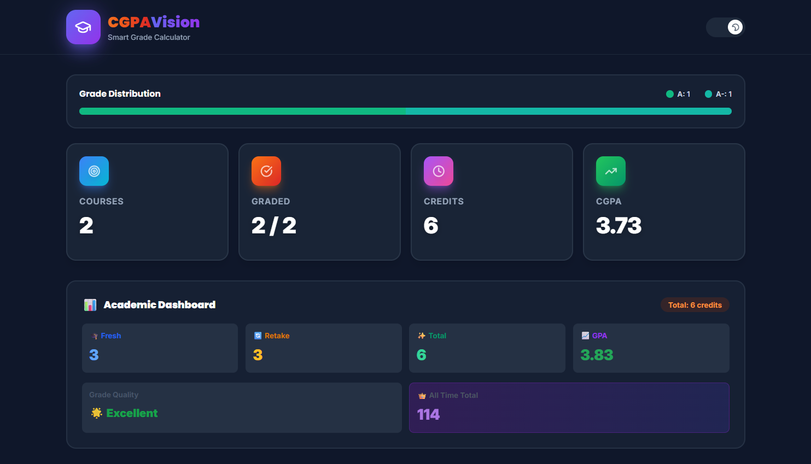
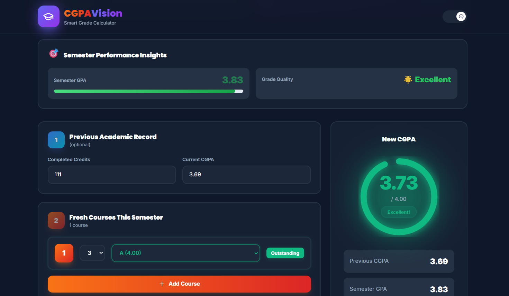

<div align="center">


**A smart CGPA calculator and academic tracker for UIU students**

<br/>

[](https://cgpa-vision-app-souravbiswas35.vercel.app/)
[](https://reactjs.org/)
[](https://vitejs.dev/)
[](https://tailwindcss.com/)
[](https://vercel.com/)

<br/>


</div>

---

## 📸 App Preview

<p align="center">
  
  &nbsp;&nbsp;
  
</p>

---

## ✨ Features

<div align="center">

| Feature | Description |
|:---:|:---|
| 🧮 **CGPA Calculator** | Semester-wise CGPA calculation with instant results |
| 📊 **Visualization** | Interactive charts to track academic performance |
| 📁 **History Tracking** | Monitor CGPA progression across all semesters |
| 📱 **Responsive Design** | Fully optimized for mobile, tablet, and desktop |
| 🎨 **Professional UI** | UIU-inspired design with Poppins & Inter fonts |
| ⚡ **Blazing Fast** | Powered by Vite for instant load times |

</div>

---

## 🛠️ Tech Stack

<div align="center">

| Technology | Purpose |
|:---:|:---|
| ⚛️ **React 18 + Vite** | Frontend framework & build tool |
| 🎨 **Tailwind CSS** | Utility-first styling |
| 📈 **Chart.js / Recharts** | Data visualization & charts |
| ▲ **Vercel** | Deployment & hosting |
| 🔤 **Google Fonts** | Poppins & Inter typography |

</div>

---

## 🚀 Getting Started

### Prerequisites

- [Node.js](https://nodejs.org/) `v18+`
- npm or yarn

### ⚙️ Installation

```bash
# 1. Clone the repository
git clone https://github.com/souravbiswas35/CGPA-Vision-App.git

# 2. Navigate into the project
cd CGPA-Vision-App

# 3. Install dependencies
npm install

# 4. Start the development server
npm run dev
```

Then open your browser and visit:

```
http://localhost:5173/
```

> 🛑 Press `Ctrl + C` to stop the server.

---

## 📁 Project Structure

```
📦 CGPA-Vision-App/
├── 📂 public/
├── 📂 screenshots/
│   ├── 🖼️ Screenshot1.png
│   └── 🖼️ Screenshot2.png
├── 📂 src/
│   ├── 📂 components/
│   ├── 📂 pages/
│   ├── ⚛️  App.jsx
│   └── 🚀 main.jsx
├── 🌐 index.html
├── 📦 package.json
├── 🎨 tailwind.config.js
└── ⚡ vite.config.js
```

---

## 🌐 Deployment

This app is deployed on **Vercel**. Every push to the `main` branch triggers an **automatic redeployment**.

🔗 **Live URL:** [cgpa-vision-app-souravbiswas35.vercel.app](https://cgpa-vision-app-souravbiswas35.vercel.app/)

### Deploy Your Own Version

```
1. Fork this repository
2. Go to vercel.com → New Project
3. Import your forked GitHub repo
4. Click Deploy — done! ✅
```

---

## 🤝 Contributing

Contributions, issues, and feature requests are welcome!

```bash
# 1. Fork the repository

# 2. Create your feature branch
git checkout -b feature/your-feature

# 3. Commit your changes
git commit -m "Add your feature"

# 4. Push to the branch
git push origin feature/your-feature

# 5. Open a Pull Request 🎉
```

---

## 📊 Project Stats

<div align="center">


</div>

---

<div align="center">

### 🌟 Show Your Support

If this project helped you, please consider giving it a ⭐ star — it means a lot!

[](https://github.com/souravbiswas35/CGPA-Vision-App/stargazers)

<br/>

Made with ❤️ by [**Sourav Biswas**](https://github.com/souravbiswas35)

</div>
